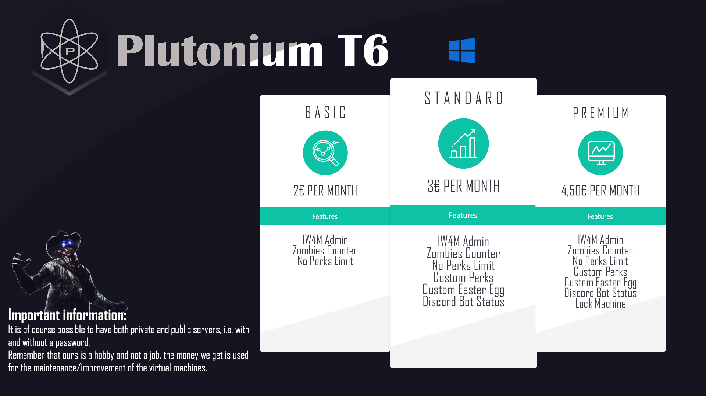
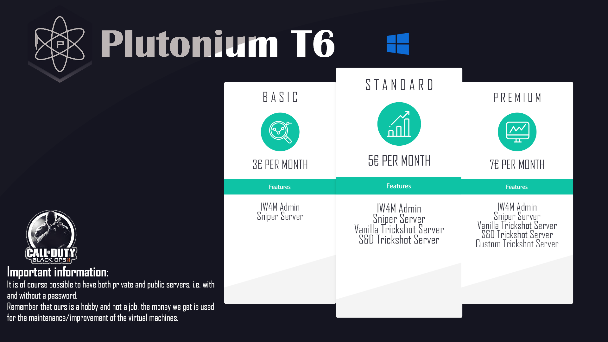

# Call of Duty: Black ops II 
Both Multiplayer and Zombies servers are available on Black ops II.  Multplayer servers will be hosted in Germany and Zombies servers in France. To get a private server for zombies you need to contact **`Williampilote#6631`** and for Multiplayer servers **`DoktorSAS#1141`**.

Order your server on our [dedicated discord](https://discord.gg/gZKx5qg2DE)

### Zombies Servers

The zombies servers are run by **`Williampilote#6631`** , but the mods are developed by  **`DoktorSAS#1141`**. This means that to request a server you only need to talk to **`Williampilote#6631`** , but if you want features in addition to the server you need to talk to **`Williampilote#6631`** and  **`DoktorSAS#1141`**.

#### Prices
Prices are decided according to the available features, you can pay less to don't get things you don't want. The system allows you to choose to have or not to have one of the features in the list. 

The list tells you what you have access to but you can also ask to deactivate a certain feature. 

### Multiplayer Servers
The multiplayer servers are operated by **`DoktorSAS#1141`** and  **`NOXSYS#0001`**. **`NOXSYS#0001`** takes care of the management of the virtual machine and can be contacted in case of problems. The main reference for both Mods and Servers is **`DoktorSAS#1141`**, in fact it is he who takes care of the servers.

#### Beta Servers
In our multiplayer servers you can get a server with features in beta-testing. The developer always wants to improve the quality of the servers and is willing to do so, but in order to test the effectiveness and stability of a code he needs testers.

#### Prices

Prices are decided according to the available type of servers, you can pay less to don't get things you don't want. 
In fact, it is possible to obtain servers with more or less features depending on the request. The servers are ditrubuilt for different categories, i.e. you can get servers with different mods by paying the bare minimum.

